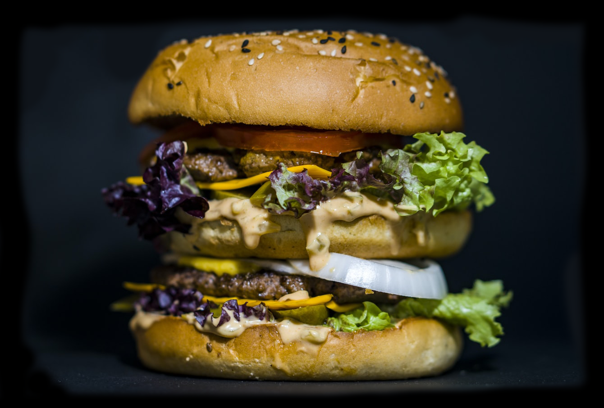
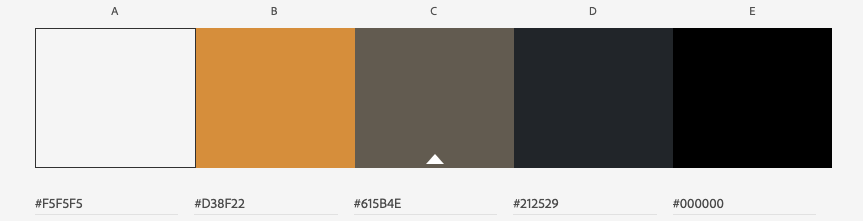
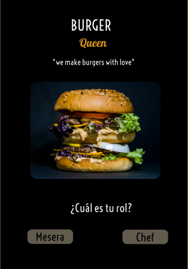
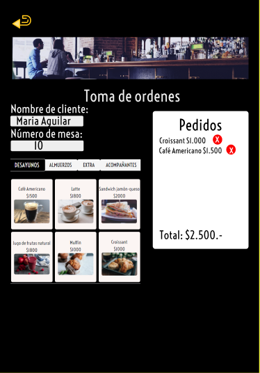
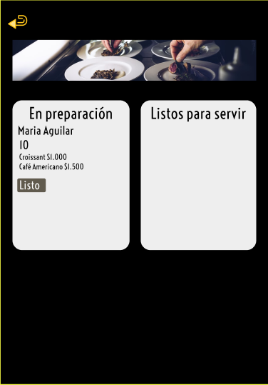
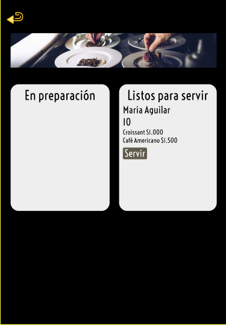
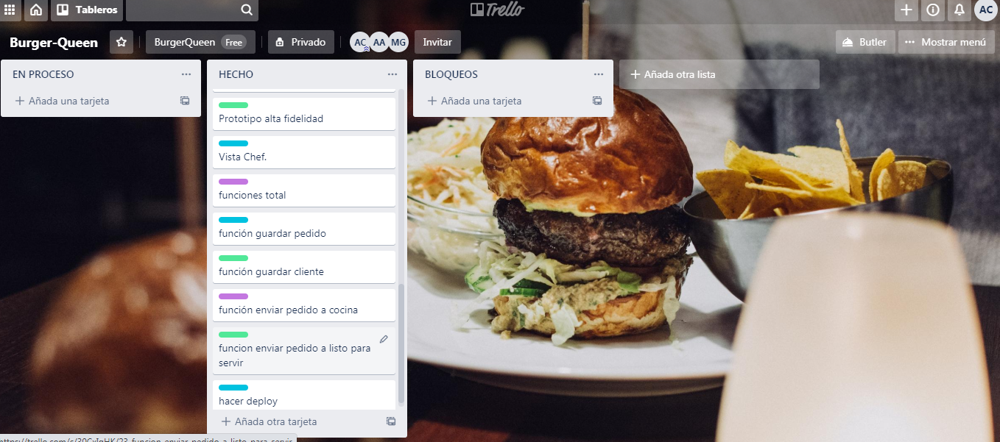

# Burger Queen 🍔

Aplicación diseñada para simplificar y optimizar la comunicación entre meseros y chef y creada para un restaurante especialistas en hamburguesas hechas 100% de carne con vacas de libre pastoreo con un sello original.

## Por Qué una app?
Simplifica la gestión de pedidos de restaurantes y bares.
Puede ser usada en cualquier tablet, smartphone, notebook y computador de escritorio.

# Fácil uso 👩‍💻
Instalar y configurar para el restaurante es muy rápido y sencillo. Todo lo que se necesita para comenzar es un dispositivo con conexión a Internet.

## Función
- Se ingresa el pedido por la mesera de turno.

- El chef prepara la orden recibida a través de una pantalla en la     cocina.

- Chef marca el pedido como listo y el camarero la lleva al cliente.

## Beneficios
- Fácil uso e instalación.

- Base de datos.

- Se puede modificar el menú y sus precios.

- Proceso más rápido.

- Eco-friendly

# Diseño  📝
Para nuestra aplicación tomamos la siguiente paleta de colores 

## Prototipo alta fidelidad 

# Planificación 📋
Para poder organizarnos de mejor manera con el equipo usamos Trello

# Futuras Mejoras 
- Se colocará un timer para tomar en cuenta el tiempo desde que se toma la orden hasta que la comida llega el cliente.
- Mostraremos el menú listo para servir.
- Se trabajará en una versión offLine del producto.

# DEPLOY 🚀

Puedes visitar nuestra app a través del siguiente link [link](https://burger-queen-a8441.web.app/)
